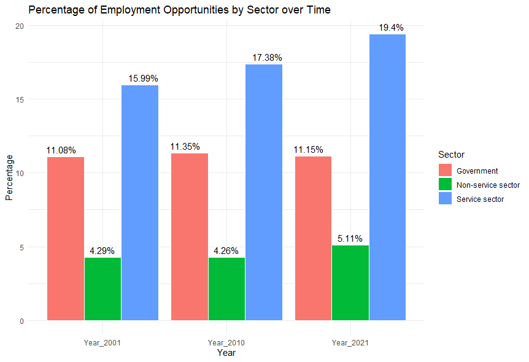
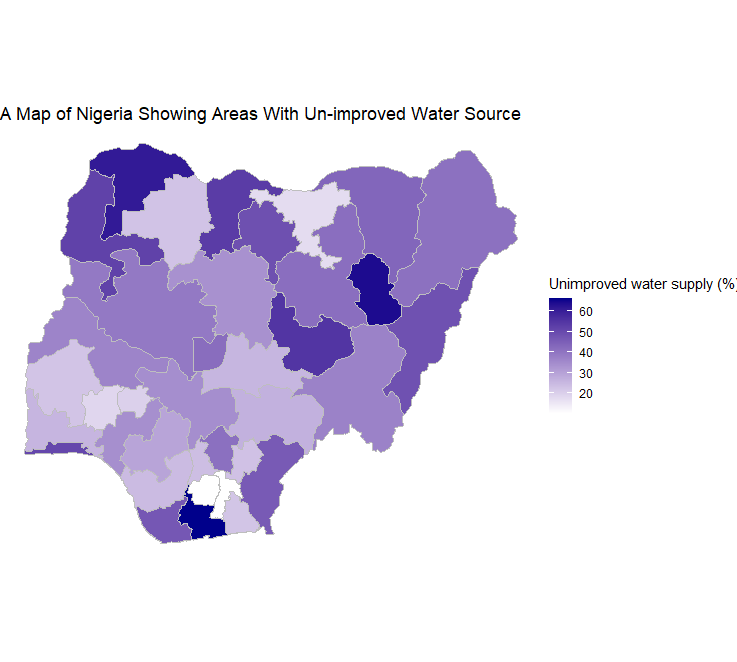

# DATA VISULAIZATION USING R

## Data Plotting using R
The data used was obtained from a class exercise in my policy class. It contains a dataset of employment by industry. The data was cleaned and prepared in Excel, and then imported into R, with the working directory set. The Tidyverse library was utilized to perform various functions, which ultimately culminated in a bar chart by GGplot2, showing either growth or decrease in the various sectors.

## Mapping data using R
For the purpose of this assignment, shapefiles of Nigeria were used. The data was obtained from the [Nigeria National Bureau of Statistics](https://www.nigerianstat.gov.ng/) website , while the shapefiles were sourced from ESRI's Living Atlas. Tidyverse library functions such as mutate were used to create a column for unimproved water source, which was in turn used to create the map using GGplot2 for plotting.

