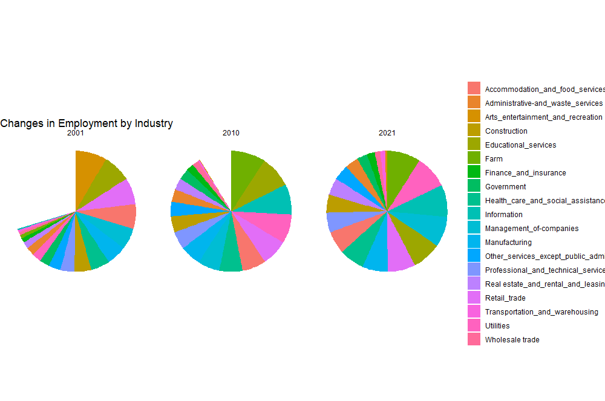

# Mastering R

## Plot 1
###TidyCensus using R
The data used for plotting the chart of five counties with the highest Median Household Income in Iowa, 2016 - 2020 American Community Survey data was obtained directly through the tidy census package. tidyverse library functions were used in its modification

## Plot 2
### Mapping data using R
The tidycensus package was equally deployed in displaying the map of Georgia showing the percentage of population with educational attainment of bachelor's degree or higher.

## Plot 3
The data from my policy class was reused in this assignment. It contains a dataset of employment by industry. The data was cleaned and prepared in Excel, and then imported into R, as a csv file. A circular bar plot graphics was used to represent changes in employment by industry.

