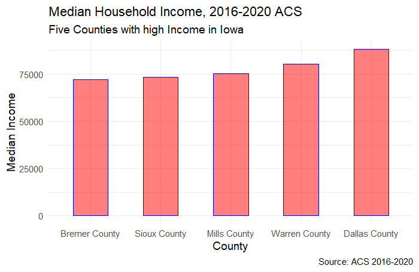
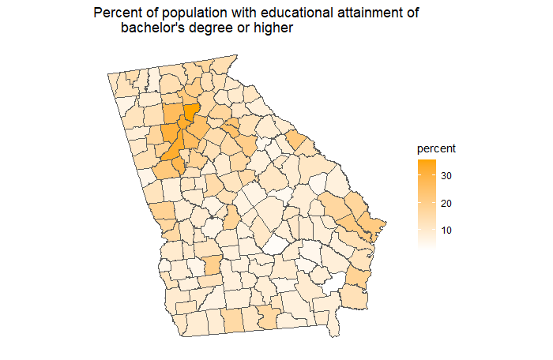

### TidyCensus using R
The data used for plotting the chart of five counties with the highest Median Household Income in Iowa, 2016 - 2020 American Community Survey data was obtained directly through the tidy census package. tidyverse library functions were used in its modification

## Plot 2
### Mapping data using R
The tidycensus package was equally deployed in displaying the map of Georgia showing the percentage of population with educational attainment of bachelor's degree or higher.

